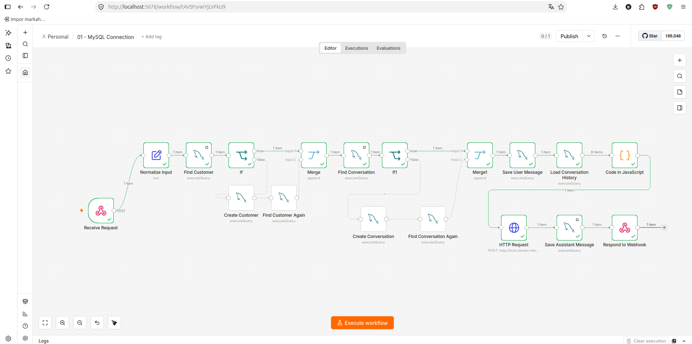
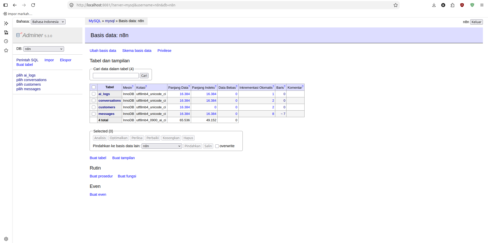
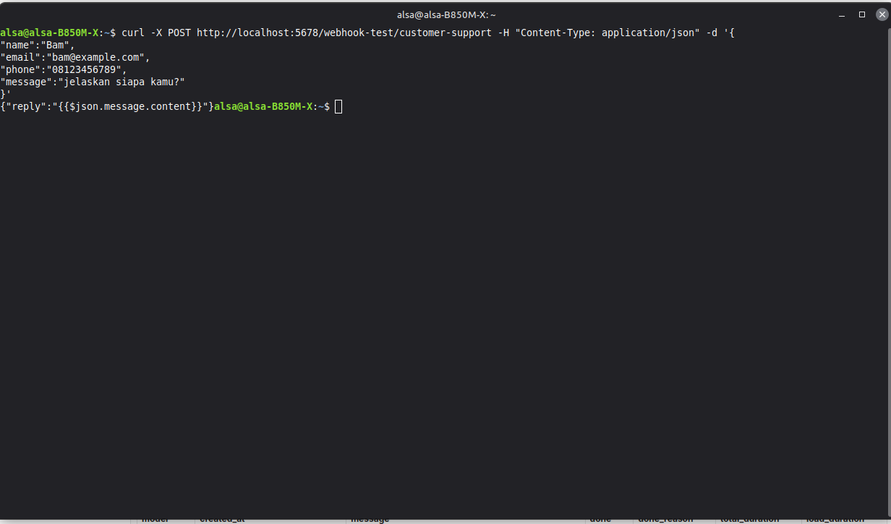
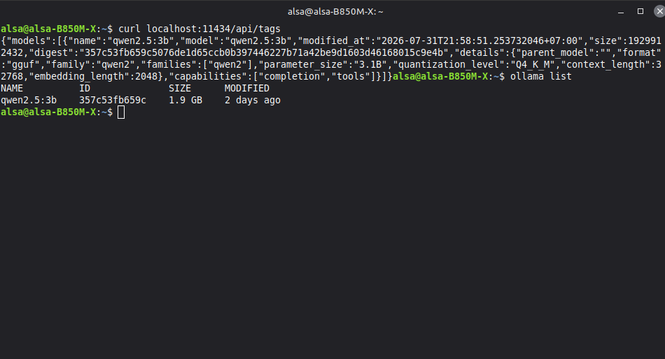
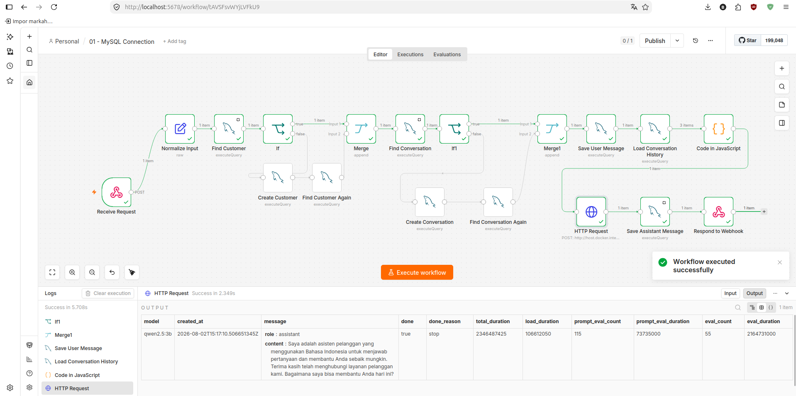

# 🤖 AI Customer Support Platform

> A self-hosted AI-powered customer support platform built with **n8n**, **Ollama**, **MySQL**, **PHP**, and **Docker**.

This project demonstrates how to build a modern customer support automation platform using workflow automation, local large language models (LLMs), and containerized infrastructure.

The platform receives customer requests through a webhook, processes them with a local AI model, stores conversation history in MySQL, and returns intelligent JSON responses.

---

# Features

- AI-powered customer support
- Self-hosted deployment
- Local LLM using Ollama
- Conversation history
- Customer management
- REST webhook API
- MySQL persistence
- Docker deployment
- n8n workflow automation

---

# Screenshots

## Workflow



---

## Database



---

## API Test



---

## Ollama



---

## Workflow Execution



---

# Architecture

The project architecture is documented separately.

- 📘 [System Architecture](docs/architecture.md)
- 📘 [API Documentation](docs/api.md)
- 📘 [Setup Guide](docs/setup.md)

---

# Technology Stack

| Layer | Technology |
|--------|------------|
| Backend | PHP |
| Workflow Automation | n8n |
| Database | MySQL |
| AI Runtime | Ollama |
| Language Model | Qwen2.5:3B |
| Deployment | Docker |
| API | REST Webhook |

---

# Project Structure

```text
n8n-ai-customer-support/
│
├── assets/
├── database/
├── docs/
├── php/
├── workflow/
├── docker-compose.yml
├── README.md
└── LICENSE
```

---

# Quick Start

Clone the repository.

```bash
git clone https://github.com/ibam28/n8n-ai-customer-support.git
```

Start Docker.

```bash
docker compose up -d
```

Pull the AI model.

```bash
ollama pull qwen2.5:3b
```

Import the workflow.

```text
workflow/customer-support.json
```

Open n8n.

```text
http://localhost:5678
```

---

# Documentation

Detailed documentation is available in the `docs/` directory.

- Architecture
- API Documentation
- Setup Guide

---

# Roadmap

## Completed

- [x] Docker environment
- [x] MySQL integration
- [x] n8n workflow
- [x] Ollama integration
- [x] REST webhook
- [x] Conversation history

## In Progress

- [ ] Admin dashboard
- [ ] PHP backend
- [ ] Authentication
- [ ] API validation

## Planned

- [ ] WhatsApp integration
- [ ] Telegram integration
- [ ] Discord integration
- [ ] Knowledge Base (RAG)
- [ ] Human handover
- [ ] Multi-agent support

---

# License

This project is licensed under the MIT License.

---

# Author

**Bam**

AI Automation Engineer Portfolio Project

GitHub: https://github.com/ibam28
