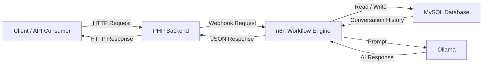
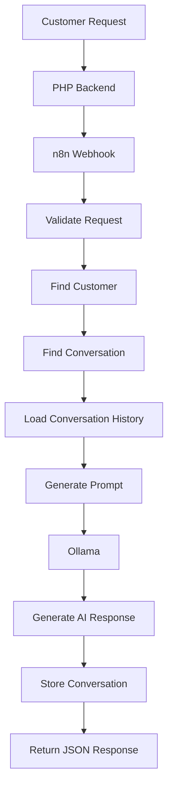
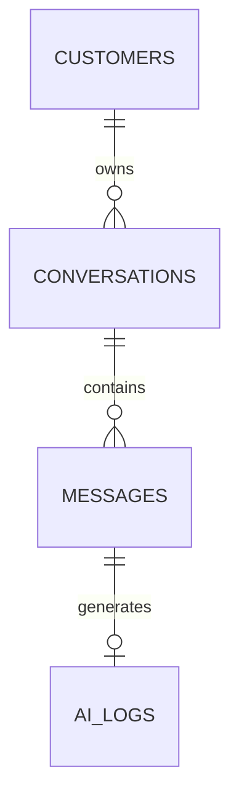

# System Architecture

## Overview

The AI Customer Support Platform is a self-hosted automation solution designed to demonstrate how modern customer support systems can be built using workflow automation, relational databases, local large language models (LLMs), and containerized infrastructure.

The platform follows a modular architecture that separates business logic, workflow automation, database operations, and AI processing into independent components. This design makes the system easier to maintain, scale, and extend.

---

## High-Level Architecture



---

## Request Flow



---

## Technology Stack

| Layer | Technology |
|--------|------------|
| Backend | PHP |
| Workflow Automation | n8n |
| Database | MySQL |
| AI Runtime | Ollama |
| Language Model | Qwen2.5:3B |
| Deployment | Docker |
| API | REST Webhook |

---

## Core Components

### PHP Backend

**Responsibilities**

- Receive client requests
- Validate input
- Forward requests to n8n
- Return JSON responses

---

### n8n Workflow Engine

**Responsibilities**

- Execute workflow automation
- Coordinate business logic
- Connect MySQL with Ollama
- Manage conversation flow

---

### MySQL Database

**Responsibilities**

- Store customer records
- Store conversations
- Store chat messages
- Store AI logs

---

### Ollama

**Responsibilities**

- Execute local language models
- Generate AI responses
- Process prompts locally

---

## Database Relationships



---

## Repository Structure

```text
n8n-ai-customer-support/
│
├── assets/
├── database/
├── docs/
│   ├── architecture.md
│   ├── api.md
│   └── setup.md
├── php/
├── sql/
├── workflow/
│   └── customer-support.json
├── docker-compose.yml
├── README.md
└── LICENSE
```

---

## Design Principles

- Self-hosted by default
- Local AI first
- Docker-first deployment
- Modular architecture
- Stateless API design
- Extensible workflows
- Production-oriented structure

---

## Roadmap

### ✅ Completed

- [x] Docker environment
- [x] MySQL integration
- [x] Customer database
- [x] Conversation history
- [x] Ollama integration
- [x] REST webhook
- [x] Local AI inference

### 🚧 In Progress

- [ ] Admin dashboard
- [ ] API documentation
- [ ] Workflow optimization

### 📋 Planned

- [ ] WhatsApp integration
- [ ] Telegram integration
- [ ] Discord integration
- [ ] Knowledge Base (RAG)
- [ ] Human handover
- [ ] Multi-agent support

---

## Author

**Bam**

AI Automation Engineer Portfolio Project

GitHub: https://github.com/ibam28
